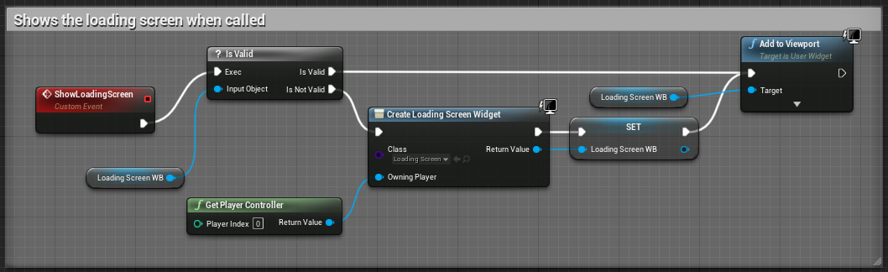

# Additional Notes
These notes were taken from the Blueprint Multiplayer tutorial series, which can be found [here](https://www.youtube.com/playlist?list=PLZlv_N0_O1gYqSlbGQVKsRg6fpxWndZqZ).     
--  
- There's a Blueprint class called GameInstance. This blueprint is not destroyed when changing levels, so it is useful for storing player information, such as the player name
- If you need to access multiple menus, an easy way to do so is by creating events in your GameInstance to add and remove widget blueprints     
  
*This event is inside the "GameInstance blueprint*
    - Loading Screen WB is a variable containing a widget blueprint, a loading screen in this case
    - Is Valid checks to see if the widget has been assigned to the variable. If it has, it'll jst add it to the viewport. Otherwise, it creates and sets the widget, then adds it to the parent.  

      
    *This event is inside the graph of a widget blueprint*  
    - Game Instance Ref is a variable containing the GameInstance. You can set it during the **Event Construct** event (should be a default)
        - Get Game Instance > Cast To [GameInstance Class name] > Set Game Instance Ref
    - Show Main Menu is an event in the GameInstance, like the one above